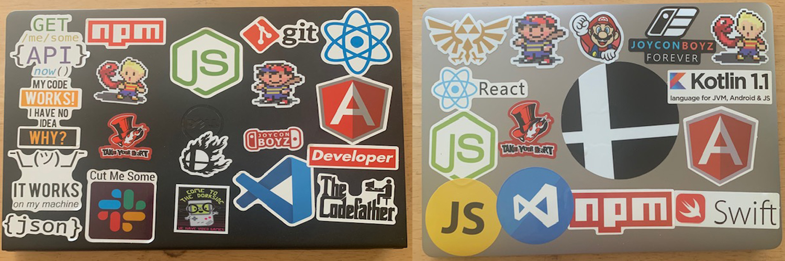

# Meet Donovan  
Hi there, I am a Computer Support IT Technician turned Self-taught Developer, occasional Mentor and Technology Instructor located in Michigan. Other than that, I am a huge Geek/Nerd when it comes to gaming both new and classic games especially most things Nintendo (I'm really good at Mario Kart and Super Smash Bros.) I also enjoy comics books, and pop culture in general.

Proud to say that I currently work at my dream company [Detroit Labs](https://www.detroitlabs.com) as a JavaScript Developer and often volunteer at a community based software developer meetup group called [Co-Labs](https://www.detroitlabs.com/colabs/). 

### Wanna talk about code or looking for a coding Mentor? My DM's are always open: 
* [LinkedIn](https://www.linkedin.com/in/browncdonovan/)
* [Online CV](https://cv.browncdonovan.com)

<!--
**DCbrown/DCbrown** is a ✨ _special_ ✨ repository because its `README.md` (this file) appears on your GitHub profile.

Here are some ideas to get you started:

- 🔭 I’m currently working on ...
- 🌱 I’m currently learning ...
- 👯 I’m looking to collaborate on ...
- 🤔 I’m looking for help with ...
- 💬 Ask me about ...
- 📫 How to reach me: ...
- 😄 Pronouns: ...
- ⚡ Fun fact: ...
-->
